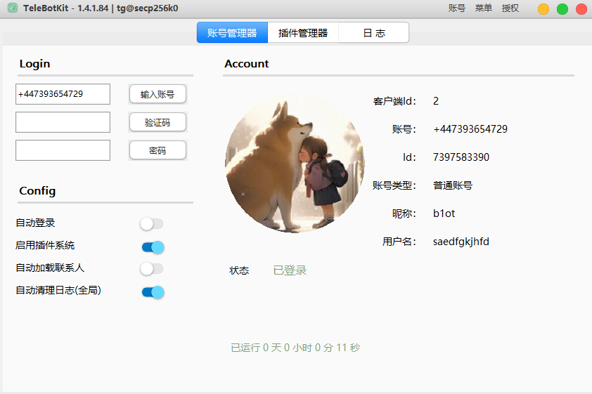
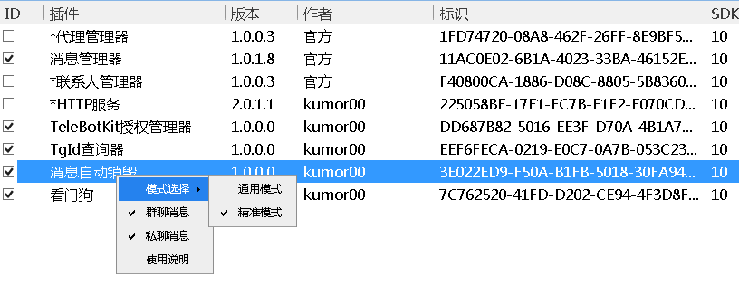
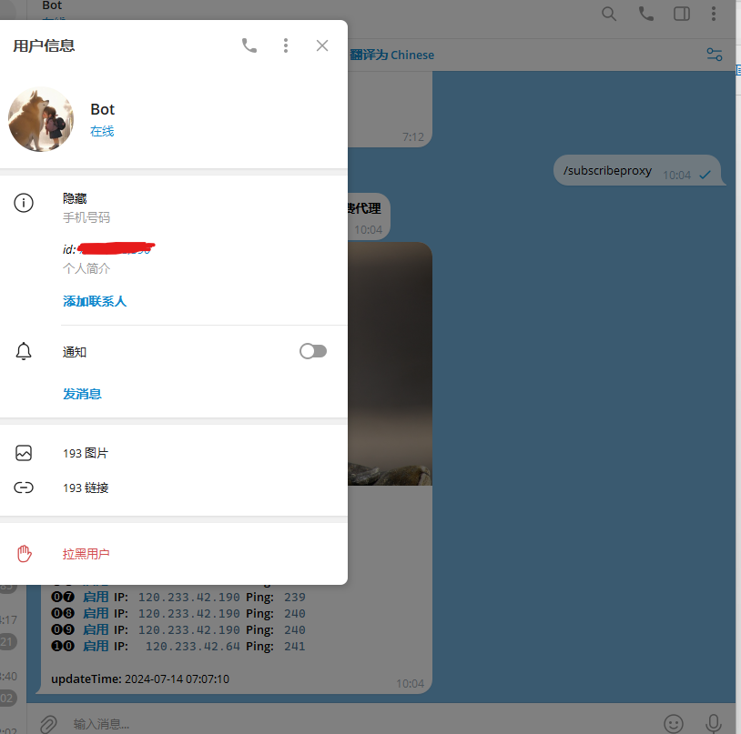
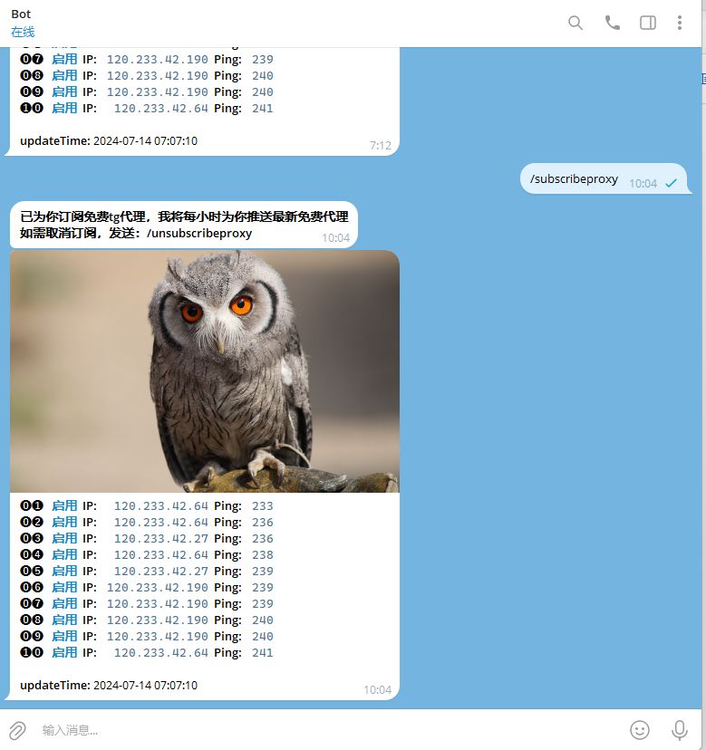

# TeleBotKit

>    

## 介绍
> 一个电报(Telegram)开发框架，基于MTProto协议  
> 支持双卡双待，支持普通账号登录(手机号+验证码, session登录正在开发中)与机器人账号登录(Token)   
> 支持多账号，框架可以多开登录，也可以在一个框架内登录多个账号    
> 支持二次开发，基于事件推送的插件系统，目前仅支持易语言开发插件    
> 

## 更新日志
>   
> [更新日志](/changelog.md)   

## 框架
> [前往下载](https://github.com/TeleBotKit/TeleBotKit/releases/latest)  

## SDK
> [前往下载](https://github.com/TeleBotKit/TeleBotKit/releases/tag/TeleBotKit-SDK)  
> [SDK文档](/SDK-DOC.md)  

## 使用
> 本框架与SDK可免费使用(限一个账号，无其它限制)，联系QQ78852405即可，请用等级大于40的大号联系    
> 如需定制功能，联系 https://t.me/secp256k0  
> 
> 

## 免责声明
> 该框架仅限个人使用，禁止从事商业活动，禁止使用SDK开发违法违规插件  
> 

## 界面
>   
>   
>   