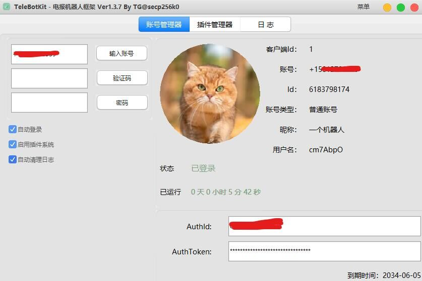

# TeleBotKit
> 一个电报(Telegram)机器人框架，支持Bot账号与人工账号双卡双待  
> 基于事件推送的插件系统  
> 已拥有30+常用接口，正在扩充中  
>   
> 

# 下载
[前往下载最新版](https://github.com/TeleBotKit/TeleBotKit/releases/latest)

# 作者
> 如需定制插件或获取SDK联系
> https://t.me/secp256k0
> QQ 78852405 

# 免责声明
> 该框架仅限个人使用，禁止从事商业活动，禁止使用SDK开发违法违规插件  
> 
