# 插件开发指南
## 1. 在插件模板常量表填写信息
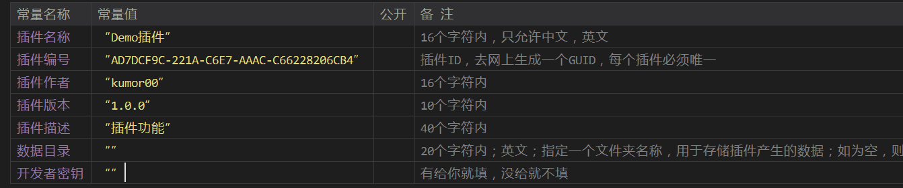   

## 2. 在OnStart函数下编写你的插件全局初始化代码
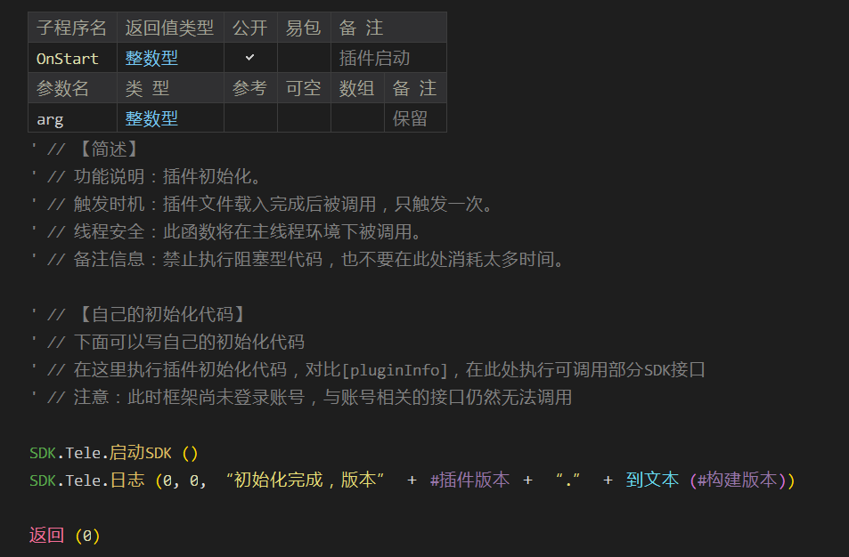   

## 3. 在OnLogin函数下编写你的插件实例化代码
### 3.1 什么是实例化？
#### 简单的说就是便于多账号开发，每个账号绑定一个类，每个账号的变量，事件完全独立互不影响。插件模板中已经分配好OnEvent类，建议将账号初始化部分代码(比如设置事件监听)写到OnEvent.Create
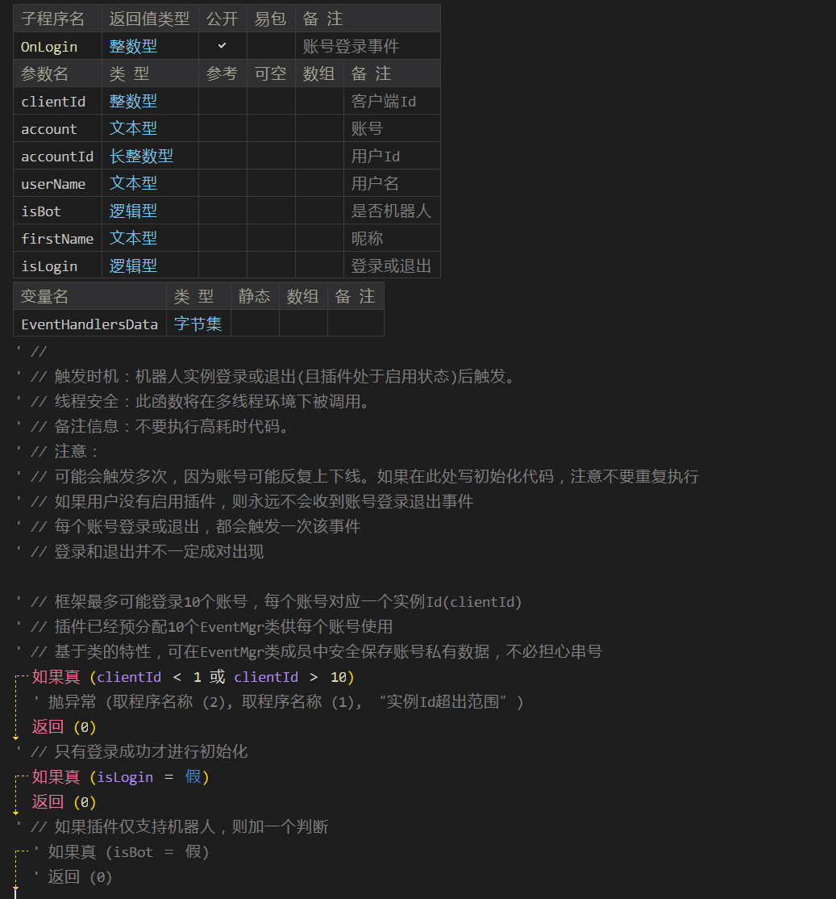   
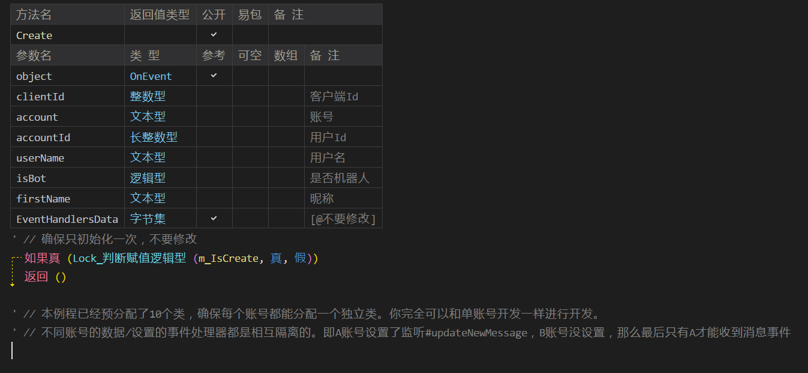   

## 4. 如何监听消息/事件？
### 4.1 监听消息
#### 4.1.1 在OnEvent.Create方法下调用【SDK.Handler.添加实例化处理器】
#### 此处的【取类方法地址 (类自身 (), 2)】表示将消息回调到本类的OnMessage方法下  
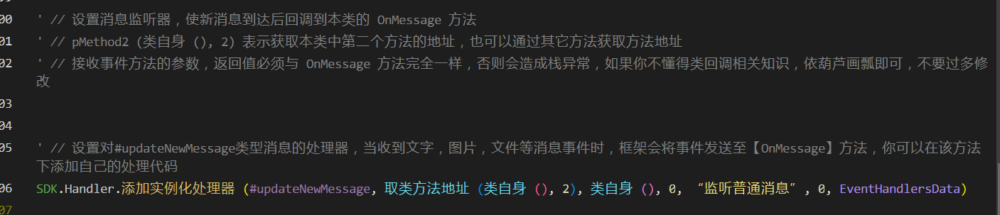   

#### 4.1.2 在OnMessage方法下解析消息Json，响应内容
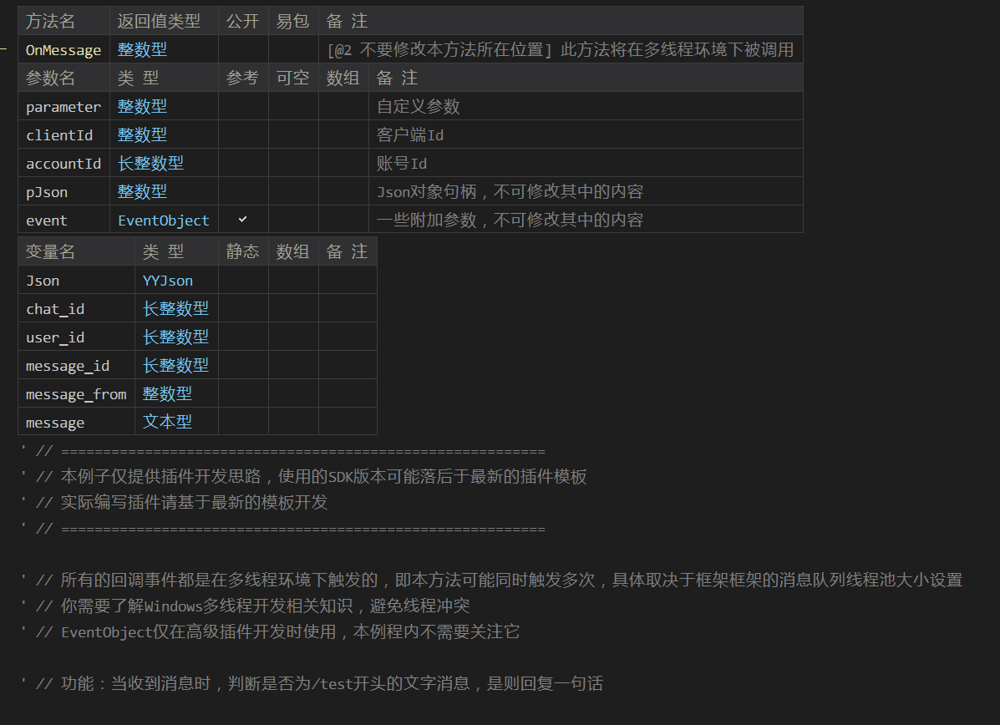     
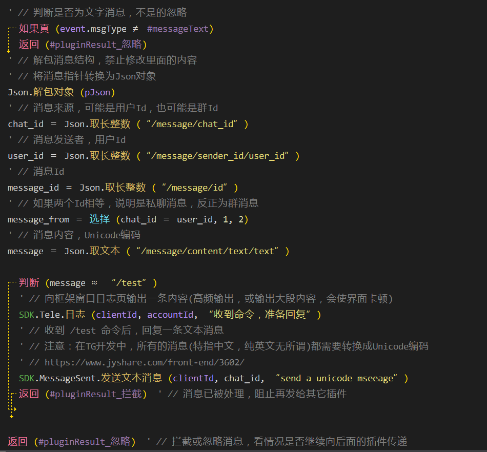    

#### 4.1.3 如何监听其它非消息事件？
#### 修改#updateNewMessage参数即可，对应事件类型查看SDK-Var15.ec中#updateNew***开头的常量
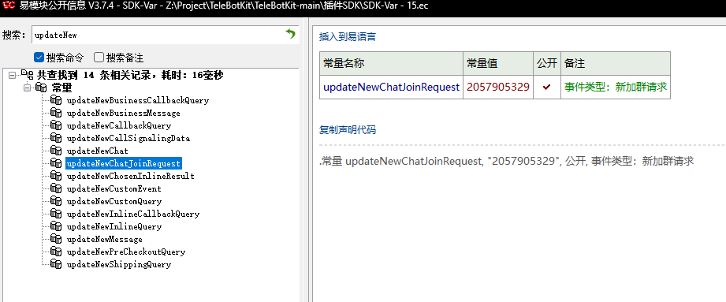     

## 4.2 监听消息(高级插件模板)
#### 4.2.1 在OnEvent.Create方法下调用【聊天交互管理器.添加文字监听器】
#### 其中pFun表示消息要回调的方法地址
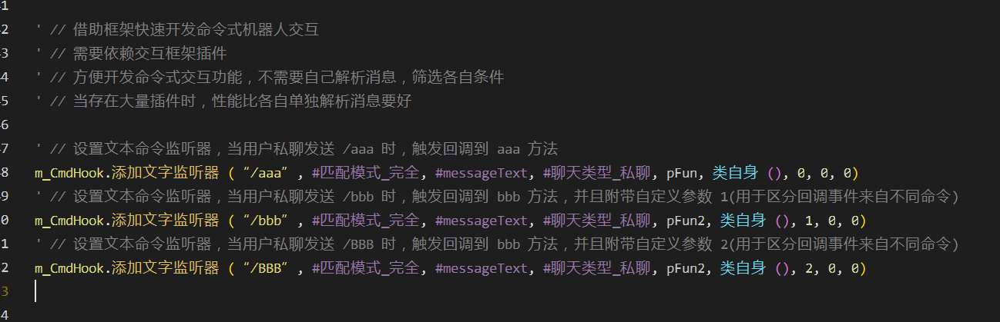   

#### 4.2.2 在回调方法下进行响应
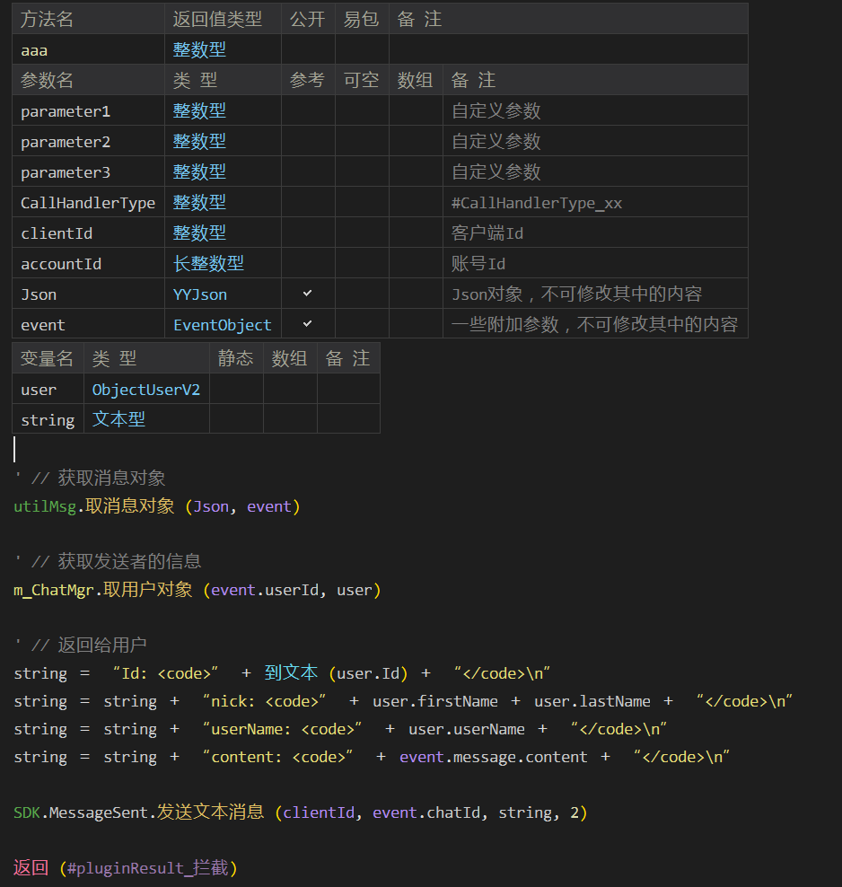   

#### 4.2.3 其它类型监听器可查看SDK模块说明
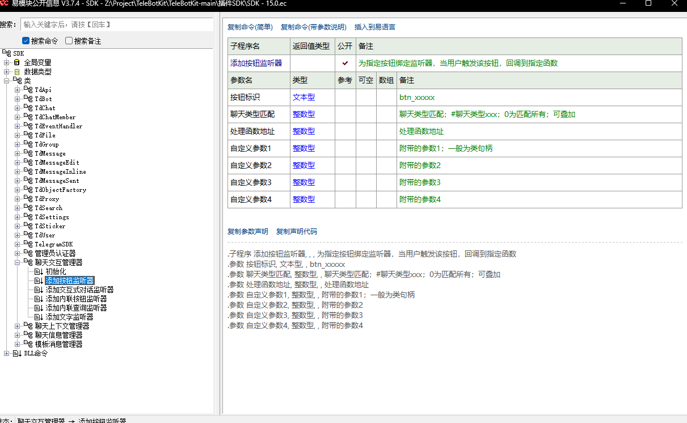     

## 5 在OnEvent.Destroy下进行实例销毁
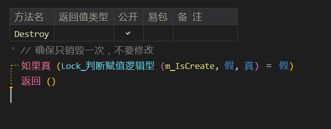     

## 6. 在OnSetting函数下管理你的插件窗口(高级插件模板)
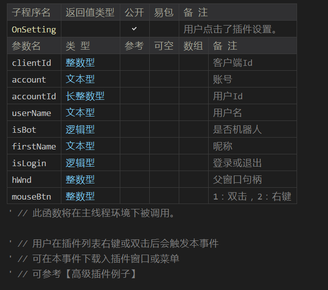   

## 7. 在OnDestroy函数下编写你的插件全局反初始化代码
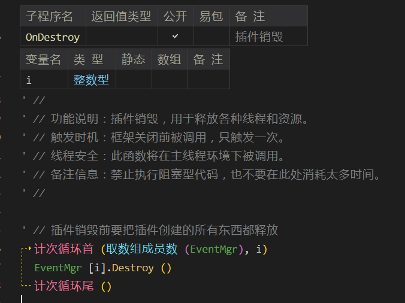   
